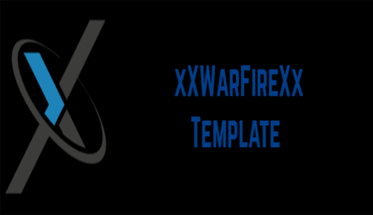

<div id="top"></div>

[![Contributors][campo-contribuciones]][url-contribuciones]
[![Forks][campo-forks]][url-forks]
[![Stargazers][campo-estrellas]][url-estrellas]
[![Issues][campo-reportes]][url-reportes]
[![MIT License][campo-licencia]][url-licencia]


<!-- PROJECT LOGO -->
<br />
<div align="center">
  <a href="https://github.com/xXWarFireXx/estructura">
    
  </a>

  <h3 align="center">Título del proyecto</h3>

  <p align="center">
    Aquí encontrarás toda la información sobre el proyecto!
    <br />
    <a href="https://github.com/xXWarFireXx/estructura"><strong>Explorar la documentación »</strong></a>
    <br />
    <br />
    <a href="https://github.com/xXWarFireXx/estructura">Ver una demo</a>
    ·
    <a href="https://github.com/xXWarFireXx/estructura/issues">Reportar un Bug</a>
    ·
    <a href="https://github.com/xXWarFireXx/estructura/issues">Sugerencias a futuro</a>
  </p>
</div>


<!-- TABLE OF CONTENTS -->
<details>
  <summary>Tabla de contenido</summary>
  <ol>
    <li>
      <a href="#sobre-el-proyecto">Sobre el proyecto</a>
      <ul>
        <li><a href="#desarrollo">Desarrollo</a></li>
      </ul>
    </li>
    <li>
      <a href="#por-donde-empezar">Por dónde empezar</a>
      <ul>
        <li><a href="#pre-requisitos">Pre-requisitos</a></li>
        <li><a href="#instalacion">Instalación</a></li>
      </ul>
    </li>
    <li><a href="#uso">Uso</a></li>
    <li><a href="#trayectoria">Trayectoria</a></li>
    <li><a href="#contribuciones">Contribuciones</a></li>
    <li><a href="#licencia">Licencia</a></li>
    <li><a href="#contacto">Contacto</a></li>
    <li><a href="#conocimientos">Conocimientos</a></li>
  </ol>
</details>


<!-- ABOUT THE PROJECT -->
## Sobre el proyecto

Aquí podrás hablar sobre tu proyecto!

<p align="right">(<a href="#top">back to top</a>)</p>

### Desarrollo

En esta sección podrás listar las librerías y dependencias que usas en tu proyecto. Pero deja algunos para la sección de conocimientos.

* [discord.py](https://discordpy.readthedocs.io/en/stable/)

<p align="right">(<a href="#top">back to top</a>)</p>


<!-- GETTING STARTED -->
## Por donde empezar

Esto es un ejemplo de cómo debes dar las instrucciones para preparar tu proyecto localmente.
Para obtener una copia local y ejecutarla, sigua los siguientes pasos.

### Pre-requisitos

Esto es un ejemplo de cómo listar cosas que neceistas para usar el software y cómo instalarlos.
* env
  ```sh
  py -m venv env
  ```

### Instalacion

_Abajo es un ejemplo de cómo instalar y preparar tu aplicación. Este template realmente no tiene dependencias externas o servicios._

1. Obtén una clave gratuita en [https://example.com](https://example.com)
2. Clona el repositorio
   ```sh
   git clone https://github.com/your_username_/Project-Name.git
   ```
3. Instala los requisitos
   ```sh
   pip install -r .\requirements.txt
   ```
4. Introcuce tu clave en `.env` dentro de la carpeta `src`
   ```js
   TOKEN = 'ENTER YOUR TOKEN';
   ```

<p align="right">(<a href="#top">back to top</a>)</p>


<!-- USAGE EXAMPLES -->
## Uso

Usa este espacio para mostrar ejemplos de cómo se puede usar el proyecto. Adicionalente capturas de pantalla, ejemplos de código y demostraciones funcionan bien en este espacio. Tu podrías enlazar más recursos.

_Para más ejemplos, por favor diríjase a la [Documentacion](https://example.com)_

<p align="right">(<a href="#top">back to top</a>)</p>


<!-- ROADMAP -->
## Trayectoria

- [x] Add Changelog
- [x] Add back to top links
- [ ] Add Additional Templates w/ Examples
- [ ] Add "components" document to easily copy & paste sections of the readme
- [ ] Multi-language Support
    - [ ] Chinese
    - [ ] Spanish

Mira los [asuntos abiertos](https://github.com/xXWarFireXx/estructura/issues) para una lista completa de sugerencias propuestas (y errores conocidos).

<p align="right">(<a href="#top">back to top</a>)</p>


<!-- CONTRIBUTING -->
## Contribuciones

Las contibuciones de código abierto hacen que la comunidad pueda aprender, inspirarse, y crear. Cualquier contribución que hagas es **muy apreciada**.

Si tienes cualquier sugerencia que nos pueda hacer mejores por favor, haz un fork sobre este repositorio y crea una `pull request`. O simplemente podrías abrir un ticket con el tag `Petición de actualización`.
No olvides darle al proyecto una estrella! Gracias!.

1. Fork the Project
2. Create your Feature Branch (`git checkout -b feature/AmazingFeature`)
3. Commit your Changes (`git commit -m 'Add some AmazingFeature'`)
4. Push to the Branch (`git push origin feature/AmazingFeature`)
5. Open a Pull Request

<p align="right">(<a href="#top">back to top</a>)</p>


<!-- LICENSE -->
## Licencia

Distribuido bajo licencia GNU AGPL v3. Puedes mirarla en [LICENSE.md][url-licencia] para más información.

<p align="right">(<a href="#top">back to top</a>)</p>


<!-- CONTACT -->
## Contacto

xXWarFireXx - [developereme@gmail.com](mailto:developereme@gmail.com?subject=CONTACTO%20DESDE%20ESTRUCTURA%20EN%20GITHUB)

Enlace del proyecto: [https://github.com/xXWarFireXx/estructura](https://github.com/xXWarFireXx/estructura)

<p align="right">(<a href="#top">back to top</a>)</p>


<!-- ACKNOWLEDGMENTS -->
## Conocimientos

Usa este espacio para listar recursos que encuentres útiles y que te gustaría darles crédito.

* [Choose an Open Source License](https://choosealicense.com)
* [GitHub Emoji Cheat Sheet](https://www.webpagefx.com/tools/emoji-cheat-sheet)
* [Img Shields](https://shields.io)
* [GitHub Pages](https://pages.github.com)

<p align="right">(<a href="#top">back to top</a>)</p>


<!-- MARKDOWN LINKS & IMAGES -->
<!-- https://www.markdownguide.org/basic-syntax/#reference-style-links -->
[campo-contribuciones]: https://img.shields.io/github/contributors/xXWarFireXx/estructura.svg?style=for-the-badge
[url-contribuciones]: https://github.com/xXWarFireXx/estructura/graphs/contributors
[campo-forks]: https://img.shields.io/github/forks/xXWarFireXx/estructura.svg?style=for-the-badge
[url-forks]: https://github.com/xXWarFireXx/estructura/network/members
[campo-estrellas]: https://img.shields.io/github/stars/xXWarFireXx/estructura.svg?style=for-the-badge
[url-estrellas]: https://github.com/xXWarFireXx/estructura/stargazers
[campo-reportes]: https://img.shields.io/github/issues/xXWarFireXx/estructura.svg?style=for-the-badge
[url-reportes]: https://github.com/xXWarFireXx/estructura/issues
[campo-licencia]: https://img.shields.io/github/license/xXWarFireXx/estructura.svg?style=for-the-badge
[url-licencia]: https://github.com/xXWarFireXx/estructura/blob/master/LICENSE.md